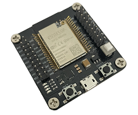
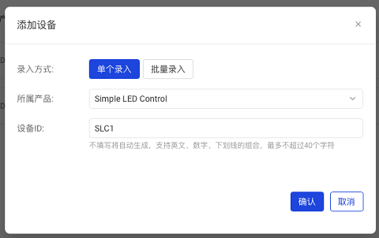

# Hello World

本教程将通过一个简单的远程控制 LED 示例，讲解如何将你的设备快速接入灵机云，成为物联网设备。

## 准备条件

本教程基于 ESP32 开发板和 Arduino 环境进行。文末也有对 ESP-IDF 环境中工作的简要说明。
下图是本案例采用的 ESP32 开发板，你也可以用你手中任意的 ESP32 系列的开发板来进行试验。



以及一个发光二极管(LED)，你可以选用你方便获得的任意 LED。


## 工具链安装

### Arduino IDE

  - 请从 [Arduino](https://www.arduino.cc/en/software) 官方获得适合您系统的 Arduino IDE 安装包进行安装；
  - 参考 [乐鑫](https://docs.espressif.com/projects/arduino-esp32/en/latest/installing.html) 官方文档，安装 Arduino-ESP32 支持包。

### 依赖库安装

  1. 从 Arduino IDE 安装
     - 在 Arduino IDE 中, 选择菜单 `项目`, `加载库`, `管理库...`。
     - 搜索并安装 `Ticos Framework`。 (当前库还未过审，请参考下面步骤手动安装)

  2. 手动安装

     - 将 [Ticos Framework](https://github.com/tiwater/ticos-framework) 克隆至 Arduino 库目录，通常该目录在 ～/Documents/Arduino/libraries，请根据你的开发平台中 Arduino IDE 的配置确定；
     - 将 [Ticos SDK](https://github.com/tiwater/ticos-sdk-for-c) 克隆至 Arduino 库目录，通常该目录在 ～/Documents/Arduino/libraries，请根据你的开发平台中 Arduino IDE 的配置确定。

## 创建产品

  1. 在[Ticos Cloud](https://console.ticos.cn)登录或注册；
   

  2. 进入 Ticos Cloud 主界面后，点击`创建产品`按钮；
   

  3. 选择`自定义品类`下的`自定义方案`；
   

  4. 为你的产品取一个好听的`产品名称`；


  5. 选择`设备模型`标签，为产品定义物模型。可以看到，产品默认有个`开关(switch)`属性，可以用于定义设备的开关功能；
   

  6. 点击`添加自定义功能`按钮，为产品增加一个`led`属性，为可读写的`Boolean`型，详见下图：
   

   至此我们的产品功能定义已经完成，可以进入功能开发阶段。

## 功能开发

### 下载脚手架工程

  1. 点击`硬件开发`标签后，点击`脚手架工程`的`配置按钮`，从脚手架工程开始快速开发：
   

  2. 本例中我们将直接采用默认配置，如下图所示：
   
   

  3. 点击`下载`按钮，将脚手架工程下载后，解压至你喜欢的开发目录；

  4. 双击解压出来的 project.ino 文件，在 Arduino IDE 中打开项目文件。

### 自定义功能

  接下来，我们将实现本产品期望达到的功能：
  按动开发板上的 BOOT 键，会让 LED 在亮、灭状态中切换，云端也可以感知到 LED 的状态变化；
  从云端也可以设置 LED 的状态，从而远程控制 LED 的亮灭。

  - 本开发板的 BOOT 键是 GPIO0, LED 连接到 GPIO23。如果你采用了不同的开发板或不同的配置，请根据你的实际配置对代码进行相应的调整；
  - 添加外设配置，详细说明请参考[文档]()：
  在
  ```
TICOS_DEV_ID_BEGIN
    DEV_IOT,
    // TODO 更多设备标识号
TICOS_DEV_ID_END
  ```
中增加项目中会用到的 GPIO 标识，如下所示：
  ```
TICOS_DEV_ID_BEGIN
    DEV_IOT,
    DEV_IO0,
    DEV_IO23,
    // TODO 更多设备标识号
TICOS_DEV_ID_END
  ```
之后在 `ticos_onboot()` 中添加代码，以在初始化过程中注册外设，如下所示：
  ```
int ticos_onboot(void) {
    TICOS_DEV_ADD(DEV_IOT, ticos_iot, .ssid=_SSID, .pswd=_PSWD, .fqdn=_FQDN,
                .product_id=_PRD_ID, .device_id=_DEV_ID, .secret_key=_SKEY);
    TICOS_DEV_ADD(DEV_IO0, ticos_gpio, .pin=0, .mode=TICOS_GPIO_MODE_INPUT);
    TICOS_DEV_ADD(DEV_IO23, ticos_gpio, .pin=23, .mode=TICOS_GPIO_MODE_OUTPUT);
    return TICOS_OK;
}
  ```
从中可以看出 GPIO0 被注册为输入端口，即我们的控制开关；GPIO23 被注册为输出端口，以驱动 LED 的亮灭。
  - 因为我们需要支持 gpio，也让我们在 project.ino 文件头部加入相关的头文件引用：
```#include <ticos/device/gpio.h>```

  - 提供外设驱动函数：
  首先定义一个变量以记录 LED 状态：
  ```
static bool g_light_on;
  ```
  然后提供一个 LED 控制函数，根据输入状态设置 LED，并将 LED 状态上报至云端：
  ```
static void set_light(bool on) {
    // 获得物模型接口
    ticos_iot_t* iot = ticos_dev(DEV_IOT, ticos_iot);
    // 设置属性值以同步至云端
    ticos_set(iot, prop_led, on);

    // 设置 LED 物理状态
    ticos_dev_setval(DEV_IO23, ticos_gpio, level, on);

    // 记录当前 LED 状态
    g_light_on = on;
}
  ```
  再提供一个开关函数，以切换 LED 的亮灭状态：
  ```
static inline void switch_light(void) {
    set_light(!g_light_on);
}
  ```
  最后，在 `ticos_onloop()` 主循环中，我们监听按键状态以切换 LED 的状态：
  ```
    ticos_gpio_t* io_0 = ticos_dev(DEV_IO0, ticos_gpio);
    if (ticos_isdirty(io_0, level)) {
        // GPIO0 被释放
        if (!ticos_get(io_0, level)) {
            switch_light();
        }
    }
  ```
  以及监听物模型 led 属性的变化，以相应设置 LED 开关：
  ```
    ticos_iot_t* iot = ticos_dev(DEV_IOT, ticos_iot);
    if (ticos_isdirty(iot, prop_led)) {
        // led 属性有改变
        bool on = ticos_get(iot, prop_led);
        set_light(on);
    }
  ```
  - 至此，我们的产品功能实现已经完成，很简单吧！接下来，让我们连上真实设备试试。

## 创建设备

  - 接下来，让我们回到[Ticos Cloud](https://console.ticos.cn)，选择`设备`菜单；
   

  - 确定`设备管理`下的下拉列表是选中了我们刚才创建的产品，然后点击`添加设备`；
  - 我们现在只是小试牛刀，就选择`单个录入`，为设备定义一个 ID；

   

  - 确认创建设备后，从设备列表中选择`详情`，进入设备详情页面，将其中的产品 ID、设备 ID、设备密钥分别拷贝到 project.ino 文件开头的 _PRD_ID、_DEV_ID 和 _SKEY 宏定义中，这样，将编译后的固件烧录到 ESP32 开发板上，其身份就是我们刚才从设备管理菜单中创建的这台设备。
   

## 网络配置

  - 将你所在环境的 Wifi 名称和密码填入project.ino 文件开头的 _SSID 和 _PSWD 宏定义中。

## 烧录固件

  - 以上终于完成了设备的配置，可以将写好的固件烧录到开发板上了；
  - 用杜邦线把 GPIO23 接到 LED 正极，GND 接到 LED 负极；
   

  - 用 USB 线将开发板连接到电脑上；
  - 在 Arduino IDE 的工具菜单中选择你所对应的开发板，此处我们选择的是：ESP32 Arduino -> ESP32 Wrover Module，4MB Flash；
  - 确保`端口`选择的是开发板所连接的端口；
   

  - 确保`端口`选择的是开发板所连接的端口；
  - 选择`项目`->`上传`菜单，或者点击`上传`按钮，启动烧录过程。如无异常，完成编译后应自动将固件烧录至开发板上。

## 真机测试

  - 烧录完成复位后，开发板应自动连接上 Wifi 和灵机云的 MQTT 服务器，通过 Arduino IDE 的`工具`->`串口监视器`，可能看到和以下类似的提示：
  ```
rst:0x10 (RTCWDT_RTC_RESET),boot:0x33 (SPI_FAST_FLASH_BOOT)
configsip: 0, SPIWP:0xee
clk_drv:0x00,q_drv:0x00,d_drv:0x00,cs0_drv:0x00,hd_drv:0x00,wp_drv:0x00
mode:DIO, clock div:1
load:0x3fff0030,len:1324
ho 0 tail 12 room 4
load:0x40078000,len:13508
load:0x40080400,len:3604
entry 0x400805f0
[   842][D][esp32-hal-psram.c:84] psramInit(): PSRAM enabled
[   888][D][WiFiGeneric.cpp:831] _eventCallback(): Arduino Event: 0 - WIFI_READY
[   976][D][WiFiGeneric.cpp:831] _eventCallback(): Arduino Event: 2 - STA_START
[  3073][D][WiFiGeneric.cpp:831] _eventCallback(): Arduino Event: 4 - STA_CONNECTED
[  3094][D][WiFiGeneric.cpp:831] _eventCallback(): Arduino Event: 7 - STA_GOT_IP
[  3094][D][WiFiGeneric.cpp:880] _eventCallback(): STA IP: 172.16.61.123, MASK: 255.255.254.0, GW: 172.16.60.1
MQTT client startedmqtt event: id = 7
D> device 0:DEV_IOT open
D> device 1:DEV_IO0 open
D> device 2:DEV_IO23 open
MQTT event MQTT_EVENT_CONNECTED
mqtt event: id = 3
  ```

  - 按下开发板上的 PROG 键，观察 LED 会随之亮灭切换；

  - 进入[Ticos Cloud](https://console.ticos.cn)的设备管理界面，留意到我们创建的设备已处于`在线状态`；
   

  - 点击对应设备的`调试`选项，进入调试界面；
   

   修改`灯`的属性值后，点击`下发`，观察 LED 的状态随之改变。

  - 进入设备详情页面的`设备孪生`标签，还可观察到 led 属性的当前值随我们按动开发板上的开关而变化（需刷新页面），说明设备状态已同步至云端。
   

## 参考代码

  - [01_HelloWorld](./01_HelloWorld/project)下是本示例的完整参考代码。


## ESP-IDF 开发

  如果你希望采用 [ESP-IDF](https://github.com/espressif/esp-idf) 进行开发，请留意以下几点：
  1. 下载脚手架工程时，`系统平台`请选择 ESP-IDF；

   

  2. 参考前述 Arduino 版本的功能开发过程，对下载的代码包中的 `project/main/project.c` 进行修改，完成代码编写；
  3. 在 project 目录下利用 ESP-IDF 进行常规项目编译和烧录，细节信息可进一步参考该目录下的 README.md 文档。