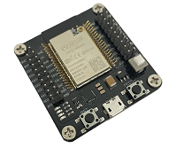
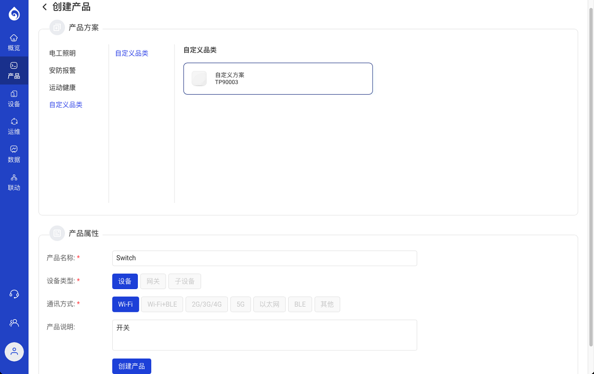
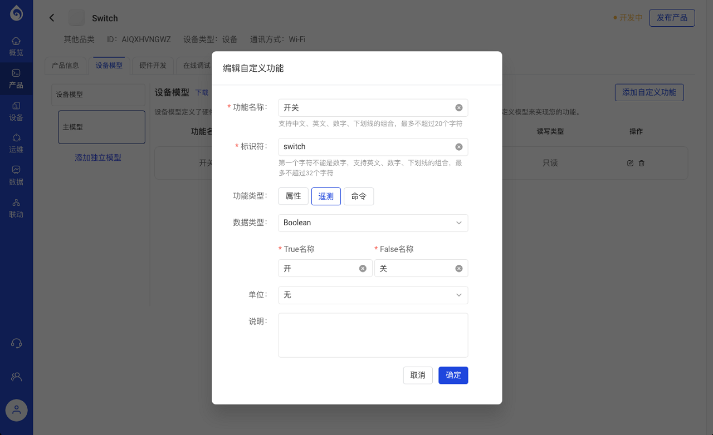
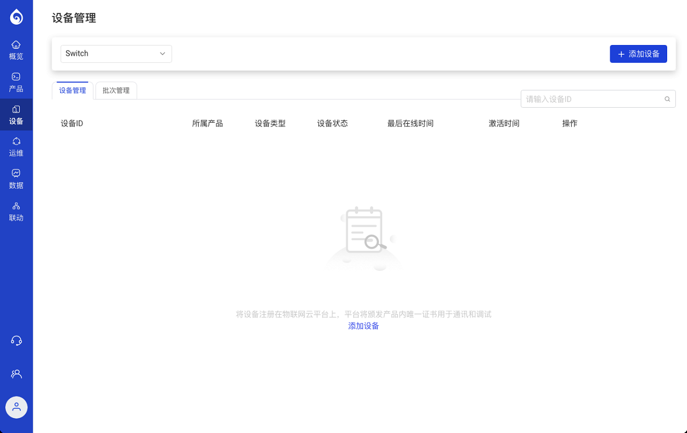
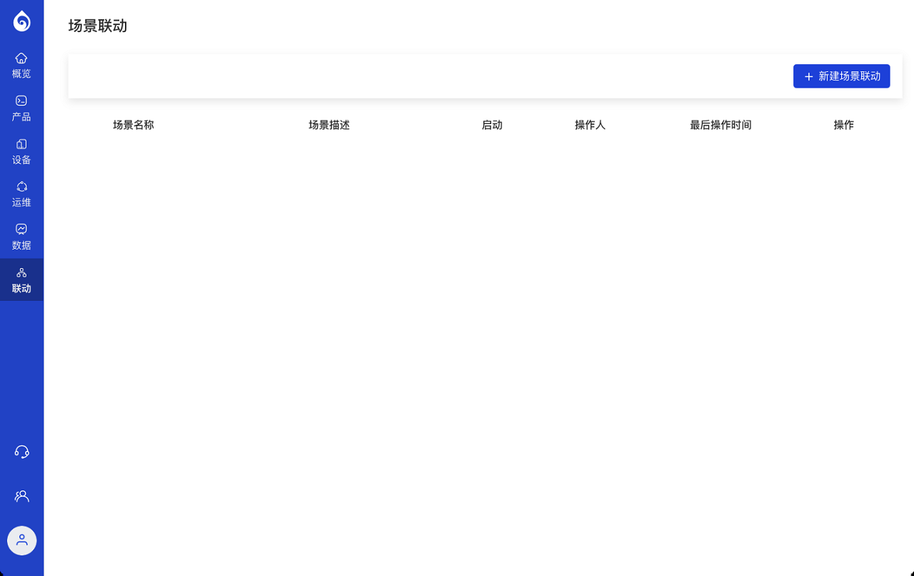
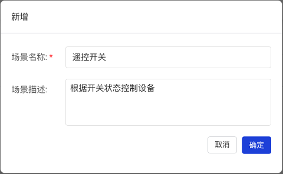
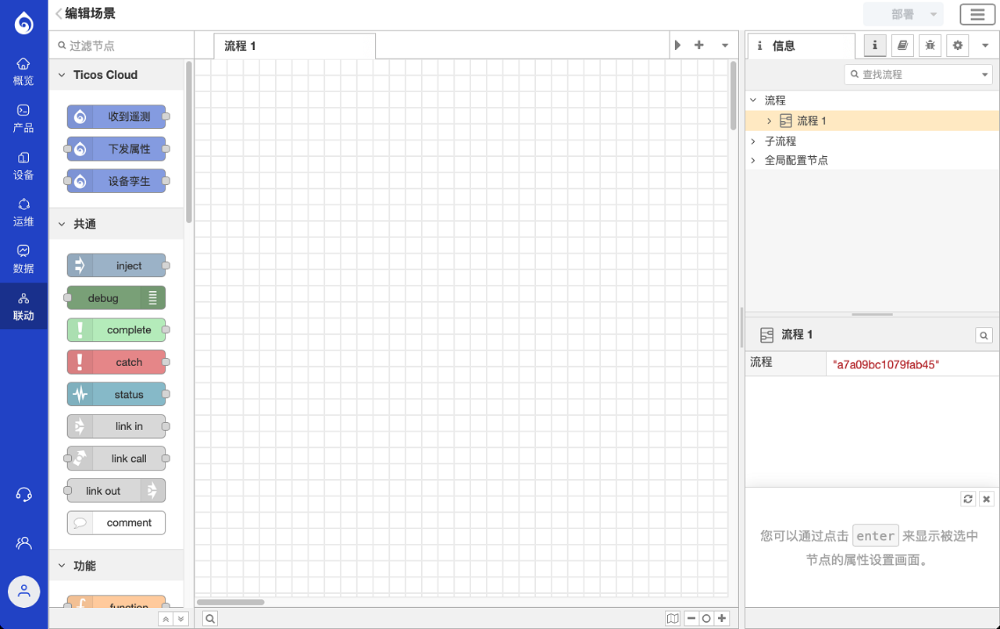
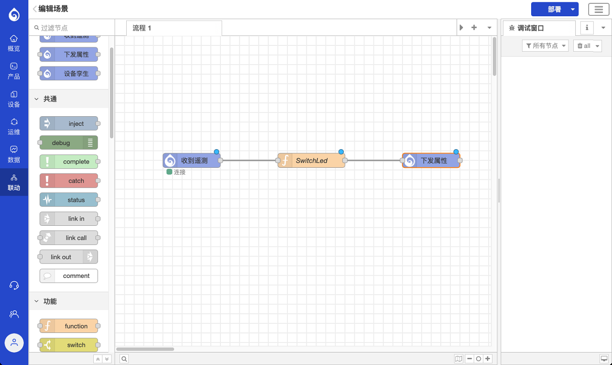

# 设备联动

本教程将在 Hello World 教程的基础上，实现设备之间的联动，即用另一台设备上的按键开关，来控制我们在第一课中创建的 LED 灯。

## 准备条件

为了实现设备联动，本教程还需要增加一块开发板作为远程开关，其他的要求同第一课。

  

## 创建产品

  1. 在`自定义品类`下的`自定义方案`中创建一个新产品，这次我们将这个设备命名为 `Switch`；

  

  2. 产品默认已经有了`开关(switch)`属性，我们可以利用起来。此处为了演示遥测上传功能，我们点击`开关`的编辑功能，将类型改为`遥测`。
   

## 功能开发

  和第一课类似，我们首先下载/建立 Arduino 脚手架工程，然后打开 project.ino 文件进行开发。

  本课期望达到的功能：
  按动今天这块开发板上的 BOOT 键，可以控制我们在第一课中创建的 LED 设备的亮、灭。

  - 首先，为按键添加外设配置：
  在
  ```
TICOS_DEV_ID_BEGIN
    DEV_IOT,
    // TODO 更多设备标识号
TICOS_DEV_ID_END
  ```
中增加项目中会用到的 GPIO 标识，如下所示：
  ```
TICOS_DEV_ID_BEGIN
    DEV_IOT,
    DEV_IO0,
    // TODO 更多设备标识号
TICOS_DEV_ID_END
  ```
之后在 `ticos_onboot()` 中添加代码，以在初始化过程中注册外设，如下所示：
  ```
int ticos_onboot(void) {
    TICOS_DEV_ADD(DEV_IOT, ticos_iot, .ssid=_SSID, .pswd=_PSWD, .fqdn=_FQDN,
                .product_id=_PRD_ID, .device_id=_DEV_ID, .secret_key=_SKEY);
    TICOS_DEV_ADD(DEV_IO0, ticos_gpio, .pin=0, .mode=TICOS_GPIO_MODE_INPUT);
    return TICOS_OK;
}
  ```
  - 在 project.ino 文件头部加入相关的头文件引用：
```#include <ticos/device/gpio.h>```

  - 在 `ticos_onloop()` 主循环中，监听按键状态并通过物模型将状态同步至云端：
  ```
    ticos_iot_t* iot = ticos_dev(DEV_IOT, ticos_iot);
    ticos_gpio_t* io_0 = ticos_dev(DEV_IO0, ticos_gpio);
    if (ticos_isdirty(io_0, level)) {
        // 按键被按动，将按键物理状态传入物模型
        ticos_set(iot, tele_switch, ticos_get(io_0, level));
    }
  ```
  - 至此，这个新开关的功能实现已经完成，接下来，进行设备配置。

## 创建设备

  - 接下来，让我们回到[Ticos Cloud](https://console.ticos.cn)，选择`设备`菜单；
   

  - 确定`设备管理`下的下拉列表是选中了我们刚才创建的产品 `Switch`，然后点击`添加设备`完成设备添加；、

  - 确认创建设备后，从设备列表中点击设备 ID 的链接，进入设备详情页面，将其中的产品 ID、设备 ID、设备密钥分别拷贝到 project.ino 文件开头的 _PRD_ID、_DEV_ID 和 _SKEY 宏定义中。

## 设备联动配置

  - 选择左侧的`联动`菜单；
   
  - 点击`+ 新建场景联动`按钮，为你要创建的场景命名，例如：`遥控开关`。并且可以提供一下合理的描述；
   
  - 点击我们新创建场景的`配置`链接，如果出现`场景启动后才可配置`的提示，点击`确认`。启动场景的时间会有点长，等待启动完成后，再次点击`配置`链接，会进入联动场景的配置界面；
   
  - 将节点列表中的`收到遥测`节点拖入中央编辑区域，并双击该节点，在弹出的对话框中为该节点配置`产品 ID` 和`设备 ID`，填入我们前面创建的开关设备的相应信息。单击`完成`以确认更改，这样，该节点即可监听制定设备的遥测事件；
  - 将`下发属性`拖动到编辑窗口中，双击，在`产品 ID` 和`设备 ID` 中填入第一课中所创建 LED 设备的对应信息，单击`完成`按钮。这样该节点即可向指定设备下发属性更改事件；
  - 拖入节点列表`功能`分类下的 `function`节点到编辑区，以实现设备间的联动控制逻辑。双击该节点，将名称改为 `SwitchLed`，在`函数`标签下输入以下内容：
  ```
var newPlayload = { led: !msg.payload["switch"],
    "$version": 1};
msg.payload = newPlayload;
return msg;
  ```
  实现根据 `switch` 遥测信号配置 `led` 属性的状态；

  - 用鼠标单击节点上的灰色小点后拖动，用连线从左至右将`收到遥测`->`SwitchLed`->`下发属性`依次连接起来，如下图所示：
   
  - 点击右上角的`部署`按钮，提示部署成功后，我们的联动逻辑已经准备就绪了。


## 网络配置

  - 将你所在环境的 Wifi 名称和密码填入project.ino 文件开头的 _SSID 和 _PSWD 宏定义中。

## 烧录固件

  - 和第一课相同，用 Arduino IDE 将本讲所开发的固件烧录至新准备的开发板上。

## 真机测试

  - 将两套开发板都上电，通过串口终端看到 `MQTT event MQTT_EVENT_CONNECTED` 提示网络连接成功后，按下或抬起远程开关的开发板上的 PROG 键，观察我们在上一例中制作的 LED 模组会随之亮灭切换；
  - 可以在联动编辑界面中加入 `debug` 节点，观察接收和发送的消息。

## 参考代码

  - [02_DeviceInteract](./02_DeviceInteract/project)下是本示例的完整参考代码。


## ESP-IDF 开发

  如果你希望采用 [ESP-IDF](https://github.com/espressif/esp-idf) 进行开发，请参考第一课的说明文档中最后一节的说明。